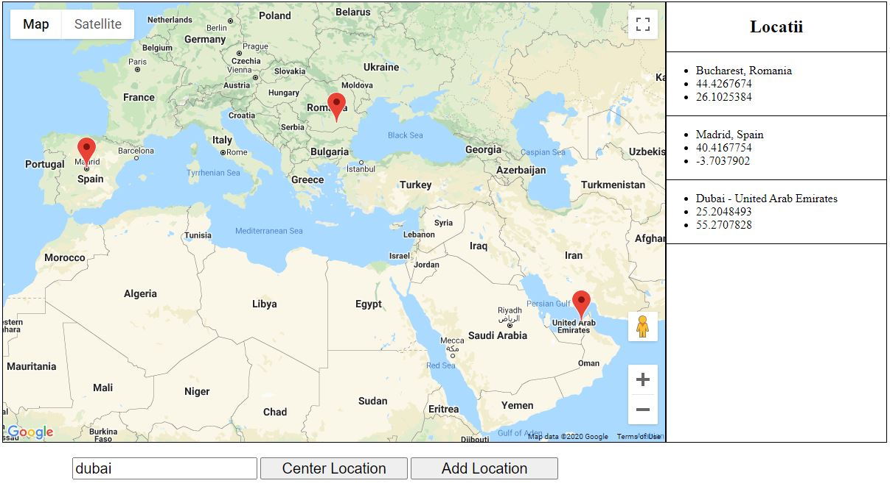

# jsInteractiveMap

## Features

* dynamic map using google maps API
* add multiple markers on map, as well as infowindow
* get latitude and longitude for all markers
* recenter map to include all markers

